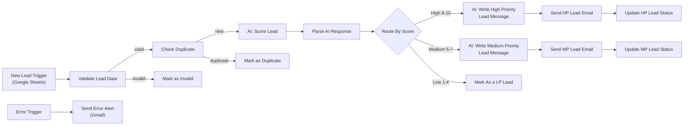

# Multi-Agent Lead System

> An n8n automation that validates, scores, and follows up on new sales leads using AI agents, with duplicate protection, priority routing, multilingual support, and a dedicated error-handling workflow.


---

## Table of Contents

- [Overview](#overview)
- [The Problem](#the-problem)
- [Key Features](#key-features)
- [Architecture](#architecture)
- [How It Works](#how-it-works)
- [Lead Scoring Model](#lead-scoring-model)
- [Tech Stack](#tech-stack)
- [Google Sheet Structure](#google-sheet-structure)
- [Getting Started](#getting-started)
- [Testing](#testing)
- [Error Handling](#error-handling)
- [Design Decisions](#design-decisions)
- [Security & Privacy](#security--privacy)
- [Limitations](#limitations)
- [Future Improvements](#future-improvements)
- [Repository Structure](#repository-structure)
- [License](#license)
- [Author](#author)

---

## Overview

**Multi-Agent Lead System** automates the first stage of a sales pipeline. When a new lead is added to a Google Sheet, the workflow validates the data, filters out duplicates, asks an AI agent to score the lead, and routes it to the right follow-up path. High and medium priority leads receive a personalized email written by a dedicated AI agent, while low priority leads are tagged for long-term nurturing.

Every path writes its outcome back to the sheet, so the sheet always reflects the true status of each lead.

## The Problem

Manual lead handling is slow and inconsistent:

- Leads wait hours or days for a first response.
- Poor-quality and duplicate entries waste sales time.
- Prioritization depends on whoever reads the lead first.
- Follow-up emails are generic or never sent.

This project replaces manual triage with a consistent, auditable pipeline.

## Key Features

- **Automatic trigger:** starts the moment a new row is added to the Leads sheet.
- **Data validation:** invalid rows are marked and stopped early.
- **Duplicate protection:** repeated leads are marked and never processed twice.
- **AI lead scoring:** an agent scores each lead from 1 to 10 using the BANT framework and explains its reasoning in one sentence.
- **Robust response parsing:** a validated parser handles markdown fences, extra text, and out-of-range values, and fails loudly on bad output.
- **Priority routing:** rule-based routing into High, Medium, and Low paths.
- **Personalized outreach:** separate AI agents write tailored emails for High and Medium leads.
- **Multilingual leads:** handles lead descriptions written in Arabic or English.
- **Full status tracking:** every path updates the lead status in Google Sheets.
- **Dedicated error workflow:** any failure triggers an email alert with the failing node, error message, and execution link.

## Architecture



> The error handler is a **separate workflow**, linked through the main workflow's *Error Workflow* setting.

## How It Works

| # | Stage | Nodes | What happens |
|---|-------|-------|--------------|
| 1 | Trigger & Validation | New Lead Trigger, Validate Lead Data | Detects a new row and checks that the required fields are present and well-formed. |
| 2 | Check Duplicates | Check Duplicate, Mark as Invalid, Mark as Duplicate | Prevents reprocessing the same lead; invalid and duplicate rows are marked and stop here. |
| 3 | AI Scoring & Response | AI: Score Lead, Parse AI Response | The AI agent returns a JSON score and reason; the parser validates and normalizes it. |
| 4 | Route by Score | Route By Score | A rules-based router splits leads into High, Medium, and Low. |
| 5 | Update & Notify (High) | AI: Write High Priority Lead Message, Send HP Lead Email, Update HP Lead Status | Writes and sends a personalized email, then updates the sheet. |
| 6 | Update & Notify (Medium) | AI: Write Medium Priority Lead Message, Send MP Lead Email, Update MP Lead Status | Writes and sends a follow-up email, then updates the sheet. |
| 7 | Update & Notify (Low) | Mark As a LP Lead | Tags the lead as low priority and updates the status. |
| - | Error Handling | Error Trigger, Send Error Alert (separate workflow) | Emails an alert when any node fails. |

## Lead Scoring Model

The scoring agent evaluates each lead using the **BANT** framework (Budget, Authority, Need, Timeline) and must respond with JSON only:

```json
{
  "score": 8,
  "reason": "One sentence citing the specific BANT factor that drove this score."
}
```

| Score | Tier | Meaning | Action |
|-------|------|---------|--------|
| 8-10 | High priority | Clear intent, budget, and urgency | Personalized email sent immediately |
| 5-7 | Medium priority | Genuine interest, but missing budget or urgency clarity | Follow-up email |
| 1-4 | Low priority | Exploratory or unqualified, no clear buying intent | Tagged for long-term nurturing |

### Parsing and validation

The `Parse AI Response` node (a JavaScript Code node) is the safety layer between the AI and the router. It:

1. Verifies the AI response contains a text block.
2. Strips markdown code fences and extracts the JSON object.
3. Parses the JSON and throws a clear error if it is invalid.
4. Converts `score` to a number and rejects anything outside 1-10.
5. Falls back to a default reason if none is provided.
6. Merges the result into the item without letting original fields overwrite `score` and `reason`.

Any failure here throws an error that triggers the error workflow, instead of silently sending a lead down the wrong path.

## Tech Stack

| Component | Purpose |
|-----------|---------|
| [n8n](https://n8n.io) (Cloud) | Workflow automation platform |
| Anthropic Claude (via n8n AI nodes) | Lead scoring and email writing agents |
| Google Sheets | Lead database and status tracking |
| Gmail | Outreach emails and error alerts |
| JavaScript (n8n Code node) | AI response parsing and validation |

## Google Sheet Structure

The workflow reads from and writes to a sheet named `Sheet1` in a spreadsheet called `Leads-Multi-Agent System`.

| Column | Filled by | Description |
|--------|-----------|-------------|
| Name | You | Lead's full name |
| Email | You | Lead's email address (validated by the workflow) |
| Company | You | Company name |
| Need | You | What the lead is looking for (Arabic or English) |
| Company Size | You | Number of employees |
| Budget Range | You | Stated budget |
| Source | You | Where the lead came from (LinkedIn, Website Form, Referral) |
| Status | Workflow | Outcome of processing (invalid, duplicate, or priority tier) |
| Score | Workflow | AI score from 1 to 10 |
| Notes | Workflow | AI reasoning for the score |

An example dataset is available in [data/Leads-Multi-Agent System - Sheet1.csv](data/Leads-Multi-Agent%20System%20-%20Sheet1.csv). It contains fictional leads written in Arabic and English, covering different quality levels.

## Getting Started

### Prerequisites

- An [n8n](https://n8n.io) account (Cloud or self-hosted)
- A Google account with access to Google Sheets and Gmail
- An Anthropic API key
- Google OAuth credentials configured in n8n (Google Sheets API and Google Drive API enabled)

### Installation

1. **Clone the repository**
   ```bash
   git clone https://github.com/anwar25hdj/multi-agent-lead-system.git
   cd multi-agent-lead-system
   ```

2. **Prepare the Google Sheet**
   Create a spreadsheet using the columns listed above, or import the example file from the `data/` folder (*File → Import* in Google Sheets).

3. **Import the workflows into n8n**
   In n8n choose *Workflows → Import from file* and import both files from `workflows/`:
   - `Multi-Agent Lead System.json`
   - `Lead System - Error Handler.json`

4. **Set up credentials**
   Create and connect these credentials in n8n:
   - Google Sheets OAuth2
   - Gmail OAuth2
   - Anthropic API

   > If you see `Forbidden - The caller does not have permission`, make sure the connected Google account owns the sheet or has **Editor** access, and that the Sheets and Drive APIs are enabled.

5. **Configure the nodes**
   - Select your spreadsheet and sheet in every Google Sheets node.
   - Review the Gmail nodes and set the sender and recipient settings.
   - Review the AI prompts and adjust the scoring criteria to your business.

6. **Link the error workflow**
   Open the main workflow, go to *Settings → Error Workflow*, choose **Lead System - Error Handler**, and save. Set your own email address in the `Send Error Alert` node.

7. **Publish**
   Publish the main workflow so it runs automatically whenever a new row is added.

## Testing

Test all five paths before relying on the workflow. Add one row per case to the sheet:

| Test case | Input | Expected result |
|-----------|-------|-----------------|
| High priority | Clear need, stated budget, urgent timeline | Score 8-10, personalized email sent |
| Medium priority | Interested, but vague budget or timeline | Score 5-7, follow-up email sent |
| Low priority | Exploratory message, no budget | Score 1-4, no email, tagged as low priority |
| Duplicate | Same email as an existing lead | Marked as duplicate, no AI call |
| Invalid | Missing or malformed email | Marked as invalid, no AI call |

**Error path test:** temporarily break a node (for example, point a Google Sheets node to a sheet that does not exist), add a lead, and confirm that the alert email arrives. Restore the configuration afterwards.

> Use test email addresses you control, so no real prospects receive messages.

## Error Handling

The project includes a dedicated **Lead System - Error Handler** workflow:


- **Error Trigger** fires when the main workflow fails during an automatic (published) run.
- **Send Error Alert** emails the failing workflow name, the last executed node, the error message, and a direct link to the execution.

Example alert body:

```
Workflow: {{ $json.workflow.name }}
Failed node: {{ $json.execution.lastNodeExecuted }}
Error: {{ $json.execution.error.message }}
Link: {{ $json.execution.url }}
```

Failures it covers include invalid AI output, expired credentials, missing permissions, and API limits.

## Design Decisions

- **Multi-agent approach:** scoring and writing are separate agents, each with a focused prompt, which keeps outputs more consistent than one large prompt.
- **Validate before spending:** invalid and duplicate leads are filtered out before any AI call, saving cost and time.
- **Fail loudly:** the parser throws on bad AI output instead of guessing, so problems are visible rather than silently misrouting a lead.
- **Rule-based routing:** routing uses deterministic score thresholds rather than AI judgment, so behavior is predictable and auditable.
- **Sheet as the source of truth:** every path writes its status back, making the process traceable without extra tooling.
- **Visual organization:** the canvas is grouped into numbered, color-coded stages so the flow can be understood at a glance.

## Security & Privacy

- No API keys, tokens, or credentials are stored in the exported workflow files; credentials are configured inside n8n.
- The example dataset contains **fictional data only**. Never commit real customer information.
- Lead data is personal data. Follow applicable data-protection rules (such as GDPR) in production.
- Consider saving outgoing emails as **drafts** for human review before enabling automatic sending.

## Limitations

- Low priority leads are only tagged; there is no automated nurture sequence yet.
- No rate limiting between leads, so large batches may hit API limits.
- The AI score depends on prompt quality and on how much information each lead provides.
- Emails are sent automatically, without human approval.

## Future Improvements

- [ ] Automated nurture email sequence for low priority leads
- [ ] Human-in-the-loop approval (draft mode) for outgoing emails
- [ ] Wait and batching nodes to respect API rate limits
- [ ] Weekly summary report of leads by tier
- [ ] CRM integration (HubSpot, Pipedrive, or Notion)
- [ ] Slack or Telegram notifications for high priority leads
- [ ] Evaluation set to measure scoring accuracy over time

## Repository Structure

```
.
├── workflows/
│ ├── Multi-Agent Lead System.json
│ └── Lead System - Error Handler.json
├── screenshots/
│ ├── Multi-Agent Lead System.png
│ └── Lead-System Error Handler.png
├── data/
│ └── Leads-Multi-Agent System - Sheet1.csv
├── README.md
└── LICENSE
```

## License

This project is licensed under the MIT License. See the [LICENSE](LICENSE) file for details.

## Author

**Anwar Hadjadj**
- GitHub: [@anwar25hdj](https://github.com/anwar25hdj)
- LinkedIn: [your-profile](https://linkedin.com/in/your-profile)
- Email: your.email@example.com

If you found this project useful, consider giving it a star.
